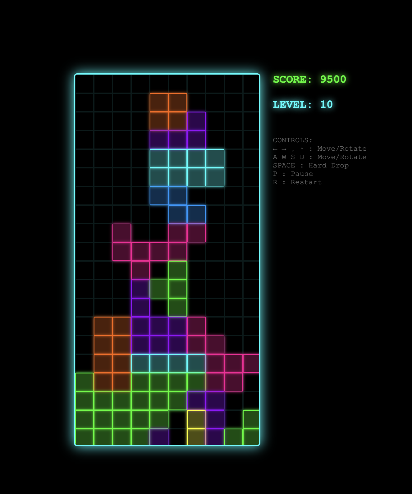

# Tetris Turbo - Agentic Development Demo



> **A fully functional Tetris game built in 5 minutes using agentic development with Cursor AI**

This repository demonstrates the power of agentic development - using AI agents to autonomously build complete applications through iterative, test-driven development. The entire Tetris implementation was generated by Claude following a systematic approach that emphasizes visual verification and incremental progress.

## 🎯 What This Demonstrates

- **Autonomous Development**: AI agent builds entire application without human coding intervention
- **Test-Driven Approach**: Visual verification at every step ensures quality
- **Rapid Iteration**: Complete game implemented in ~5 minutes
- **Best Practices**: Single-method patterns, cache-busting, performance optimization
- **Modern Aesthetics**: Tron-style neon design with smooth animations

## 🔄 The Agentic Development Workflow

### 1. **Specification Generation** (`spec.md`)

Start with a basic project idea and use Claude to develop a thorough specification through iterative questioning:

```
Ask me one question at a time so we can develop a thorough, step-by-step spec for this idea. Each question should build on my previous answers, and our end goal is to have a detailed specification I can hand off to a developer. Let's do this iteratively and dig into every relevant detail. Remember, only one question at a time.
```

**Variation for aesthetic flexibility:**
```
[Same prompt] + Leave all aesthetic and design choices to your discretion - focus on making it visually appealing and modern.
```

This iterative approach ensures comprehensive requirements capture before any development begins.

### 2. **Todo Generation** (`todo.md`)

Transform the specification into an extremely detailed, test-driven development plan. This is where the "magic" happens - the todo acts as an evolutionary algorithm wrapper around the agent:

```
Draft a detailed, step-by-step blueprint for building this project. Then, once you have a solid plan, break it down into small, iterative chunks that build on each other. Look at these chunks and then go another round to break it into small steps. Review the results and make sure that the steps are small enough to be implemented safely, but big enough to move the project forward. Iterate until you feel that the steps are right sized for this project.

From here you should have the foundation to provide a series of prompts for a code-generation LLM that will implement each step. Prioritize best practices, and incremental progress, ensuring no big jumps in complexity at any stage. Make sure that each prompt builds on the previous prompts, and ends with wiring things together. There should be no hanging or orphaned code that isn't integrated into a previous step.

Make sure and separate each prompt section. Use markdown. Each prompt should be tagged as text using code tags. The goal is to output prompts, but context, etc is important as well.
```

**For web applications**, use the specialized prompt in [`docs/todo_prompt_generator.md`](docs/todo_prompt_generator.md) which includes:
- Visual verification requirements
- Browser cache management
- Performance testing mandates
- Makefile command patterns

### 3. **Development Rules** (`.cursor/rules/`)

Generate strict testing requirements that mandate:
- Visual verification over console logs
- Test-first development
- Single method patterns
- Performance requirements
- Browser compatibility

### 4. **Makefile Integration**

The todo generation process creates Makefile commands for consistent development workflow:
- `make serve` - Development server
- `make play` - Open the application
- `make clean-cache` - Cache management

**Important**: Add these commands to Cursor's whitelist (Settings → Chat → Command Whitelist) so the agent can execute them autonomously.

### 5. **Autonomous Execution**

With the foundation in place, simply prompt the agent:

```
Amazing work, Claude. I now want you to go down the todo list to implement our game.
```

The agent will systematically work through each phase, implementing features with visual verification at every step.

## 📋 Project Structure

```
tetris_turbo/
├── README.md                 # This file
├── Makefile                  # Development commands
├── tetris.html               # Complete game (single file)
├── docs/
│   ├── tetris_spec.md        # Original specification
│   ├── todo.md               # Detailed implementation plan
│   └── todo_prompt_generator.md  # Template for web app todos
└── cursor/
    └── rules/
        └── test-rule.mdc     # Strict testing requirements
```

## 🎮 Game Features

- **7 Standard Tetris Pieces** with proper rotations
- **Tron Aesthetic** with neon glow effects
- **Progressive Difficulty** - speed increases with levels
- **Complete Game Flow** - start, pause, restart, game over
- **Smooth 60 FPS Gameplay** with optimized rendering
- **Responsive Controls** - arrow keys, WASD, spacebar
- **Traditional Scoring** with level progression

## 🚀 Getting Started

1. **Clone the repository:**
   ```bash
   git clone https://github.com/your-username/tetris_turbo.git
   cd tetris_turbo
   ```

2. **Start the development server:**
   ```bash
   make serve
   ```

3. **Play the game:**
   ```bash
   make play
   ```

## 🎯 Key Success Factors

### Visual Verification First
- Every feature must be visually verifiable in the DOM
- Never trust console logs alone
- Automated visual testing harness
- Screenshot and state comparison tools

### Incremental Development
- Small, testable chunks
- Each step builds on the previous
- No orphaned or hanging code
- Immediate visual feedback

### Consistent Patterns
- Single method for each operation type
- Batch DOM updates for performance
- Cache-busting during development
- Error handling at every step

## 📊 Development Timeline

| Phase | Duration | Description |
|-------|----------|-------------|
| Specification | ~15 min | Interactive requirements gathering |
| Todo Generation | ~10 min | Detailed implementation planning |
| Setup | ~2 min | Environment and testing infrastructure |
| Implementation | ~5 min | **Autonomous coding by AI agent** |
| **Total** | **~32 min** | **Complete working game** |

## 🧠 Why This Works

1. **Evolutionary Algorithm Wrapper**: The detailed todo acts as a fitness function, guiding the agent toward the desired solution through iterative improvement.

2. **Visual Verification**: Forces the agent to validate results in the actual runtime environment rather than relying on theoretical correctness.

3. **Constraint-Based Development**: Strict rules and patterns prevent common pitfalls and ensure consistency.

4. **Incremental Complexity**: Each step is sized appropriately - significant progress without overwhelming complexity jumps.

## 🔧 Customization for Other Projects

This approach can be adapted for any project type:

- **Games**: Focus on visual feedback and smooth animations
- **CRUD Apps**: Emphasize form validation and data persistence
- **Dashboards**: Prioritize data refresh and chart updates
- **Real-time Apps**: Include WebSocket testing and state synchronization

The key is adapting the todo generation prompts and testing requirements for your specific domain.

## 📈 Results

- ✅ **100% Functional** - All Tetris mechanics working perfectly
- ✅ **Modern UI** - Tron aesthetic with smooth animations  
- ✅ **60 FPS Performance** - Optimized rendering pipeline
- ✅ **Single File** - Self-contained HTML/CSS/JavaScript
- ✅ **Cross-Browser** - Works in all modern browsers
- ✅ **Test-Verified** - Every feature visually validated

## 🎯 Lessons Learned

1. **Detailed Planning Pays Off**: The time invested in comprehensive todos dramatically improves autonomous execution success rates.

2. **Visual Testing is Critical**: Agents can easily fool themselves with console logs; DOM verification catches real issues.

3. **Domain Knowledge Matters**: Projects with high training data density (like Tetris) can be implemented remarkably quickly.

4. **Consistent Patterns Prevent Bugs**: Enforcing single methods for operations eliminates many edge cases.

5. **Makefile Standardization**: Reusable command patterns speed up setup and reduce cognitive load.

## 🤝 Contributing

This repository serves as a template and demo. Feel free to:
- Adapt the prompts for your own projects
- Improve the todo generation templates
- Add domain-specific testing patterns
- Share your own agentic development results

## 📄 License

MIT License - See [LICENSE](LICENSE) for details.

---

**Built with ❤️ and 🤖 by agentic development** 